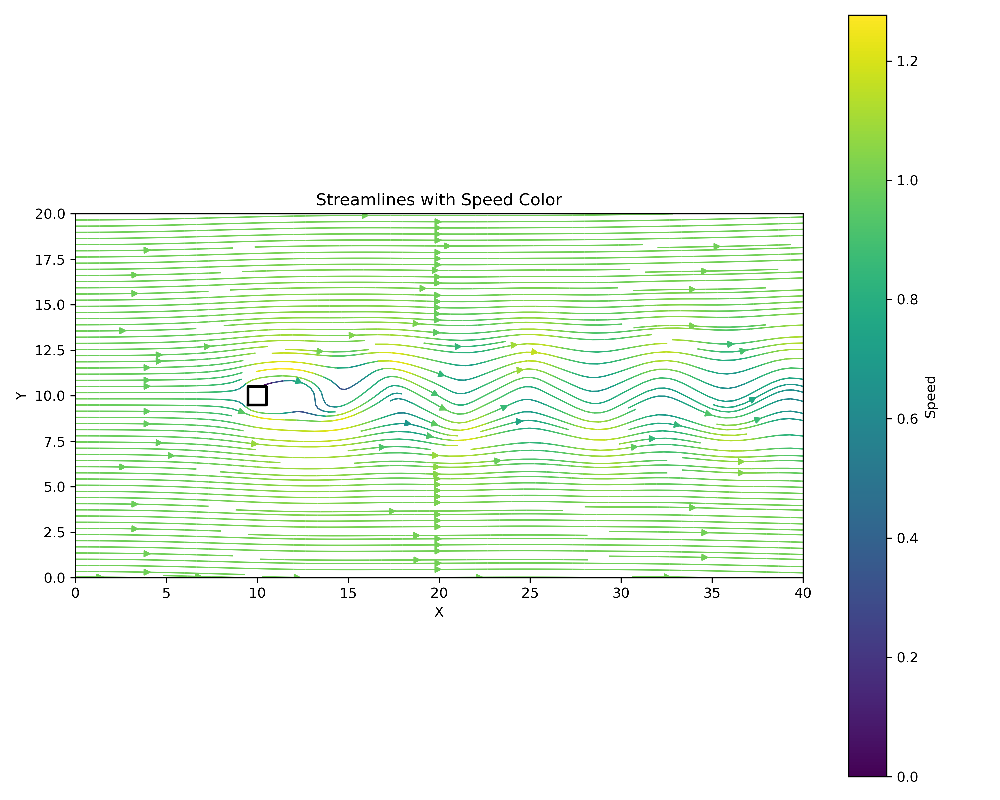

# Two-dimensional-incompressible-flow-solver-based-on-finite-difference-method
This is a two-dimensional incompressible flow solver based on the finite difference method implemented in C++, mainly simulating the fluid motion around rectangular obstacles.

## The code solves the Navier-Stokes equations using the following methods:
* Finite difference discretization
* Pressure correction method (Poisson equation solves pressure)
* Successive over-relaxation iteration (SOR)
### Physical Model:
There is a 10✖️10 square obstacle in the 200✖️400 pipe, and the fluid flows in from the right boundary.


## Source code introduction:
* ``` fluid_base.cpp ``` is the serial version as the baseline version
* ``` fluid_omp.cpp ``` is a version that uses OpenMP for CPU parallelization
* ``` fluid_cuda.cu ``` is a version that uses CUDA for GPU parallelization
* ``` post.py ``` is used to post-process the output data and generate contours
